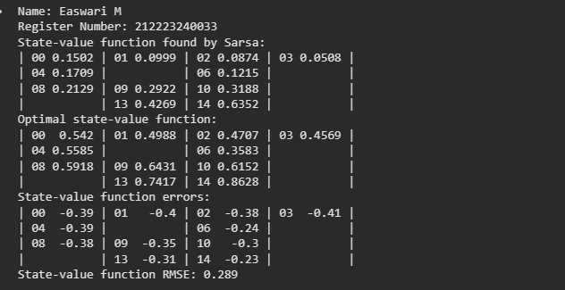
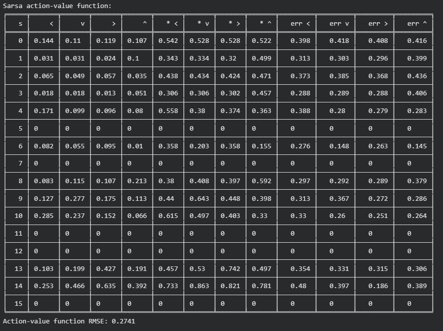
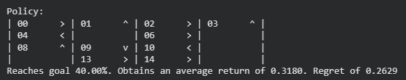
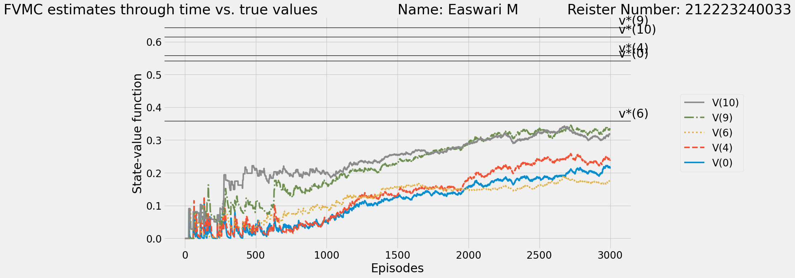
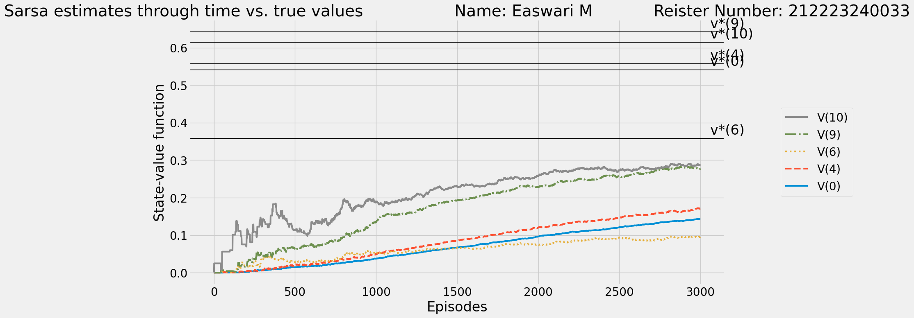

# SARSA Learning Algorithm

## AIM
To develop a Python program to find the optimal policy for the given RL environment using SARSA-Learning and compare the state values with the Monte Carlo method.

## PROBLEM STATEMENT

To train an agent with SARSA Learning in Gym environment, making optimal actions for maximizing cumulative rewards and through calculating Action value function for each step,to plot the comparison achieved by Monte Carlo method and Sarsa Learning.

## SARSA LEARNING ALGORITHM

### Step-1:
Initialize the Q-table with random values for all state-action pairs.

### Step 2:
Initialize the current state S and choose the initial action A using an epsilon-greedy policy based on the Q-values in the Q-table.

### Step 3:
Repeat until the episode ends and then take action A and observe the next state S' and the reward R.

### Step 4:
Update the Q-value for the current state-action pair (S, A) using the SARSA update rule.

### Step 5:
Update State and Action and repeat the step 3 untill the episodes ends

## SARSA LEARNING FUNCTION

### Name: Easwari M
### Register Number: 212223240033

*Sarsa Learning Program*

```
def sarsa(env,
          gamma=1.0,
          init_alpha=0.5,
          min_alpha=0.01,
          alpha_decay_ratio=0.5,
          init_epsilon=1.0,
          min_epsilon=0.1,
          epsilon_decay_ratio=0.9,
          n_episodes=3000,
          max_steps=200):
    nS, nA = env.observation_space.n, env.action_space.n
    pi_track = []
    Q = np.zeros((nS, nA), dtype=np.float64)
    Q_track = np.zeros((n_episodes, nS, nA), dtype=np.float64)

    alphas = decay_schedule(init_alpha,
                           min_alpha,
                           alpha_decay_ratio,
                           n_episodes)
    epsilons = decay_schedule(init_epsilon,
                              min_epsilon,
                              epsilon_decay_ratio,
                              n_episodes)

    select_action = lambda state, Q, epsilon: np.argmax(Q[state]) \
        if np.random.random() > epsilon \
        else np.random.randint(len(Q[state]))

    for e in tqdm(range(n_episodes), leave=False):
        state = env.reset()
        action = select_action(state, Q, epsilons[e])

        for t in count():
            next_state, reward, done, _ = env.step(action)
            next_action = select_action(next_state, Q, epsilons[e])

            # SARSA Update
            Q[state][action] = Q[state][action] + alphas[e] * \
                               (reward + gamma * Q[next_state][next_action] * (not done) - Q[state][action])

            state, action = next_state, next_action

            if done:
                break
            if t >= max_steps - 1:
                break

        Q_track[e] = Q
        pi_track.append(np.argmax(Q, axis=1))

    V = np.max(Q, axis=1)
    pi = lambda s: {s:a for s, a in enumerate(np.argmax(Q, axis=1))}[s]
    return Q, V, pi, Q_track, pi_track
```

## OUTPUT:

Optimal policy, Optimal value function 



Success rate for the optimal policy


Plot of state value functions of Monte Carlo method



Plot of state value functions of SARSA learning



## RESULT:

Thus  by using SARSA learning, an agent has been successfully trained for optimal policy and the comparison between the Monte Carlo Method and Sarsa Learning has been displayed.
